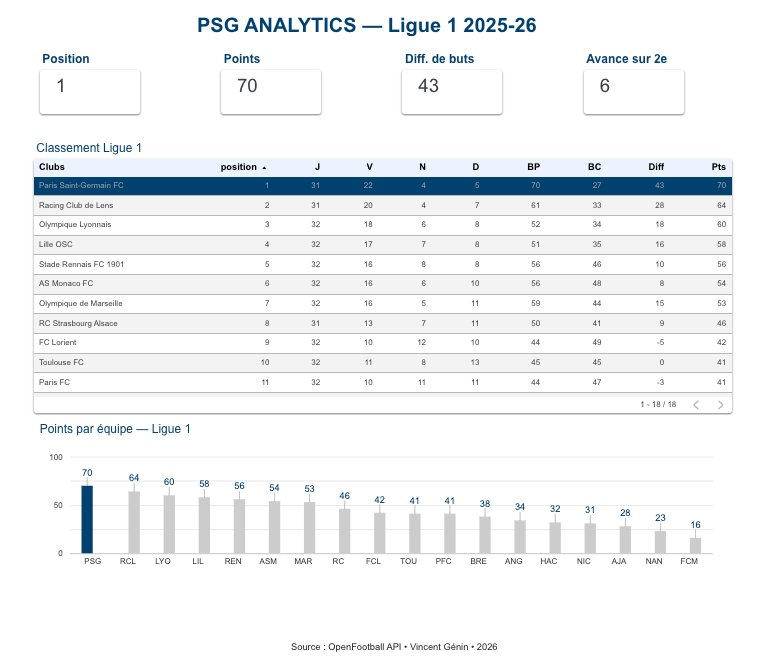
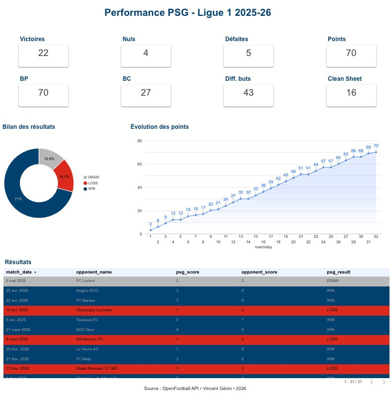
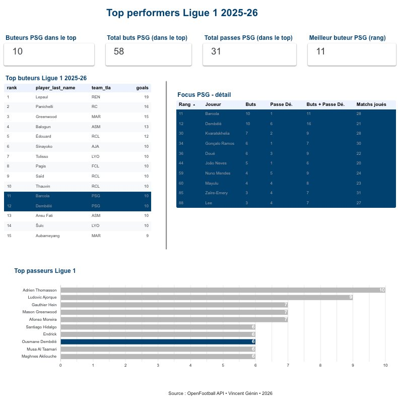

# PSG Analytics — Dashboard & Assistant IA

> Outil complet d'analyse de la performance du **Paris Saint-Germain en Ligue 1**, combinant data engineering, visualisation et intelligence artificielle générative.

[](https://www.python.org/)
[](https://cloud.google.com/bigquery)
[](https://www.getdbt.com/)
[](https://streamlit.io/)
[](https://datastudio.google.com/reporting/7e12323e-aed2-4884-9ee2-b3c1e4b170c6)
[](https://psg-analytic.streamlit.app)
[](LICENSE)

---

## Problématique

> Comment analyser et rendre intelligibles les performances du PSG à partir de données publiques, en combinant des outils data modernes et un assistant IA conversationnel ?

## Assistant IA

**Assistant PSG — live** : https://psg-analytic.streamlit.app

Interface conversationnelle propulsée par l'API Claude (Anthropic) avec tool use BigQuery. Pose des questions en langage naturel sur le PSG et la Ligue 1 — l'agent interroge les données en temps réel.

## Dashboard interactif

**Dashboard public Looker Studio** : https://datastudio.google.com/reporting/7e12323e-aed2-4884-9ee2-b3c1e4b170c6

Trois pages d'analyse :

| Page | Contenu |
|---|---|
| **1. Classement** | Tableau du classement Ligue 1 avec mise en évidence du PSG |
| **2. Performance PSG** | Bilan saison : V/N/D, points cumulés, clean sheets, derniers matchs |
| **3. Top performers** | Top buteurs et passeurs L1 + focus sur les joueurs PSG |

### Aperçu

**Page 1 — Classement Ligue 1**



**Page 2 — Performance PSG**



**Page 3 — Top performers**



## Auteur

**Vincent Génin** — Data Analyst
Certifié *Claude AI Fluency*, *Building with the Claude API*, *Dataiku*, *dbt*.

## Stack technique

| Composant | Outil |
|---|---|
| Langage | Python |
| Source de données | [football-data.org](https://www.football-data.org/) API |
| Stockage | BigQuery |
| Transformation | dbt |
| Visualisation | Looker Studio |
| Assistant IA | API Claude (Anthropic) |
| Interface | Streamlit |
| Versioning | Git / GitHub |
| Déploiement | Streamlit Cloud |

## Architecture

```
football-data.org API
        ↓
   raw_*  (BigQuery)
        ↓ dbt
   stg_*  (staging — nettoyage)
        ↓ dbt
   mart_* (analytique)
        ↓
Looker Studio  +  Assistant Claude (Streamlit)
```

## Plan du projet

| Phase | Contenu | Statut |
|---|---|---|
| **Phase 1** | Cadrage & Setup | ✅ Terminée |
| **Phase 2** | Collecte & Modélisation (Python + BigQuery + dbt) | ✅ Terminée |
| **Phase 3** | Dashboard Looker Studio | ✅ Terminée |
| **Phase 4** | Assistant IA (Streamlit + API Claude) | ✅ Terminée |
| **Phase 5** | Déploiement & Documentation | ✅ Terminée |

## Modélisation dbt

Trois couches dans BigQuery (`psg_analytics` dataset) :

| Couche | Modèles | Type | Rôle |
|---|---|---|---|
| **raw** | `raw_matches`, `raw_standings`, `raw_scorers` | TABLE | Données brutes ingérées par scripts Python |
| **staging** | `stg_matches`, `stg_standings`, `stg_scorers` | VIEW | Nettoyage, typage, flags PSG dérivés |
| **marts** | `mart_classement`, `mart_psg_matches`, `mart_top_scorers` | TABLE | Métriques métier prêtes pour le dashboard |

Pour reconstruire toute la chaîne :
```bash
# 1. Collecte API → raw
python scripts/collect_all.py

# 2. Transformation raw → staging → marts
cd dbt && dbt build

# 3. Documentation interactive (lineage graph)
dbt docs generate && dbt docs serve --port 8081
```

## Structure du projet

```
psg-analytics/
├── docs/          Documentation projet (questions métier, décisions, etc.)
├── data/          Échantillons et données brutes locales (gitignorées)
├── notebooks/     Exploration Jupyter
├── scripts/       Scripts de collecte API → BigQuery
├── dbt/           Modèles dbt (raw → staging → marts)
├── dashboard/     Captures et liens Looker Studio
└── app/           Application Streamlit avec assistant Claude
```

## Démarrage rapide

```bash
# 1. Cloner le repo
git clone https://github.com/vinzgnn/psg-analytics.git
cd psg-analytics

# 2. Créer l'environnement virtuel
python3 -m venv .venv
source .venv/bin/activate  # macOS / Linux

# 3. Installer les dépendances
pip install -r requirements.txt

# 4. Configurer les variables d'environnement
cp .env.example .env
# puis éditer .env pour y mettre tes clés

# 5. Tester l'appel API
python scripts/test_api.py
```

## Variables d'environnement

Voir `.env.example` pour la liste complète. Au minimum :

- `FOOTBALL_DATA_API_KEY` — token football-data.org
- `ANTHROPIC_API_KEY` — clé API Claude (Phase 4)
- `GOOGLE_APPLICATION_CREDENTIALS` — chemin vers la clé de service GCP (Phase 2)

## Licence

MIT — voir [LICENSE](LICENSE).
